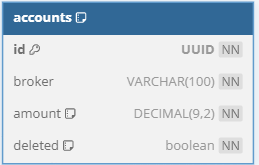
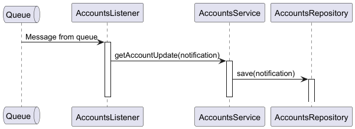

# folio-app-accounts

## Purpose
> This MS has the purpose of managing the account (by broker) balance. It will leverage the benefits of using RabbitMQ to read messages from others MS. The development for this MS has been divided into phases to make the delivering of value be more frequent. The phase one had the focus of reading from the queue and updated a created account balance and a second phase that will provide a broader subset of capabilities levering restful apis for it.

## Tech Stack
* [Java 21](https://adoptium.net/temurin/releases/)
* [Spring Boot](https://spring.io/)
* [RabbitMQ](http://www.rabbitmq.com/)
* [Test Containers](https://testcontainers.com/)
* [SonarCloud](https://sonarcloud.io/)
* [GitHub Actions](https://docs.github.com/en/actions/)
* [Postgres](https://www.postgresql.org/)
* [Flyway](https://www.red-gate.com/products/flyway/)

## How to run the application
`$ mvn spring-boot:run` or
`$ docker compose up -d`

## One-Page Architecture

Database Diagram

Sequence Diagram

