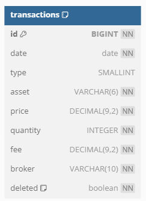

# folio-app-transactions

## Purpose
> This MS has the purpose of managing the asset transactions, such as buying and selling stock, record dividends and other types of tradings. It will leverage the benefits of using RabbitMQ to post messages to others MS as well. The development for this MS has been divided into phases to make the delivering of value be more frequent. The phase one had the focus of holding stock transactions (CRD, no U) and to get the infrastructure ready. Phase two will focus on posting messages to the account MS to process the account balance. Regarding phase three, the main goal is to connect with asset management.

## Tech Stack
* [Java 21](https://adoptium.net/temurin/releases/)
* [Spring Boot](https://spring.io/)
* [RabbitMQ](http://www.rabbitmq.com/)
* [Test Containers](https://testcontainers.com/)
* [SonarCloud](https://sonarcloud.io/)
* [GitHub Actions](https://docs.github.com/en/actions/)
* [Postgres](https://www.postgresql.org/)
* [Flyway](https://www.red-gate.com/products/flyway/)

## How to run the application
`$ mvn spring-boot:run` or
`$ docker compose up -d`

## One-Page Architecture

Database Diagram

Sequence Diagram

